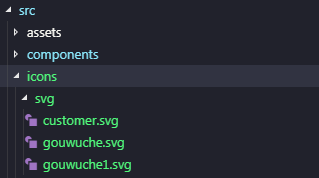

# Vue-cli3里用svg-sprite-loader
## svg-sprite-loader做了什么
> svg-sprite-loader 的插件，用来根据导入的 svg 文件自动生成 symbol 标签并插入 html，接下来就可以在模版中方便地使用 svg-sprite 技术了。 
----
## 使用 svg-sprite 的好处
- 页面代码清爽
+ 可使用 ID 随处重复调用
- 每个 SVG 图标都可以更改大小颜色
----
## 安装插件
    npm install svg-sprite-loader --save-dev
----
## vue.config 配置
```js
const path = require('path')
function resolve(dir) {
 return path.join(__dirname, '.', dir)
}
module.exports = {
 chainWebpack: config => {
  config.module.rules.delete("svg"); //重点:删除默认配置中处理svg,
  
  config.module
    .rule("svg1")
    .test(/\.svg$/)
    .use("svg-sprite")
    .loader("svg-sprite-loader")
    .options({
        symbolId: "icon-[name]"
    })
    .end()
    .include.add(resolve("src/icons"))//处理svg目录
    .end();
 },
}
```
::: tip 提示
resolve("src/icons") 处理svg目录根据自己项目而定
::: 
## 文件创建
1. [iconfont](https://www.iconfont.cn/)下载svg图标
2. 在src目录下创建icons文件，icons文件下放入下载的svg图片
3. 把下载的svg图标放在svg

 
::: warning 注意
注:要单个单个的svg图标的下载，而且每个图标的svg命名要和类名一样
:::
## 手动导入
1. 在用到的地方引入需要的svg
```js
import './src/icon/gouwuche.svg';
```
2.加入通用 CSS 代码
```css
<style>
.icon {
  width: 1em;
  height: 1em;
  vertical-align: -0.15em;
  fill: currentColor;
  overflow: hidden;
}
</style>
```
3. 页面上使用svg-sprite
```html
<svg class="icon" aria-hidden="true">
  <use xlink:href="#icon-gouwuche"></use>
</svg>
```
::: tip 提示
这样做每次都要导入十分不便，有没有更好的方法呢？
::: 
## 自动导入
1. 在icons文件里创建一个index.js 文件,在文件里写入以下代码
```js
const requireAll = requireContext => requireContext.keys().map(requireContext);
const req = require.context("./svg", false, /\.svg$/);

requireAll(req);
```
2. main.ts中引入
```js
import './icons/index',
```
3. 既然是在vue中就需要组件化
```vue
<template>
 <svg :class="svgClass" aria-hidden="true">
  <use :xlink:href="iconName"/>
 </svg>
</template>
 
<script>
export default {
 name: 'SvgIcon',
 props: {
  iconClass: {
   type: String,
   required: true
  },
  className: {
   type: String,
   default: ''
  }
 },
 computed: {
  iconName() {
   return `#icon-${this.iconClass}`
  },
  svgClass() {
   if (this.className) {
    return 'svg-icon ' + this.className
   } else {
    return 'svg-icon'
   }
  }
 }
}
</script>
 
<style scoped>
.svg-icon {
 width: 1em;
 height: 1em;
 vertical-align: -0.15em;
 fill: currentColor;
 overflow: hidden;
}
</style>
```
4. 在index.js加入注入组件代码,让组件注入到全局
```js
import Vue from "vue";
import SvgIcon from "@/components/svgIcon"; // svg组件

// register globally
Vue.component("svg-icon", SvgIcon);

const requireAll = requireContext => requireContext.keys().map(requireContext);
const req = require.context("./svg", false, /\.svg$/);

requireAll(req);

```
5. 大功告成，现在可以在任意页面使用
```html
<svg-icon icon-class="gouwuche"></svg-icon>
```
